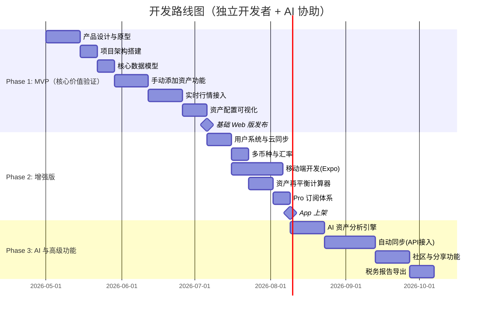

# 🌍 全球资产配置追踪器 — 深度调研分析报告

> **调研者背景**：蚂蚁集团 Staff Product Designer，拥有丰富的电子钱包和跨境收付款产品设计经验，计划以独立开发者身份启动开发。

---

## 目录
1. [产品价值与市场需求分析](#一产品价值与市场需求分析)
2. [独立开发者可行性评估](#二独立开发者可行性评估)
3. [Delta 产品深度拆解](#三delta-产品深度拆解)
4. [战略建议与下一步行动](#四战略建议与下一步行动)

---

## 一、产品价值与市场需求分析

### 1.1 宏观市场背景：全球资产配置正从「小众」走向「主流」

> [!IMPORTANT]
> QDII 基金总规模已接近 **1万亿人民币**（截至2026年1月），同比大幅增长。监管层明确要求QDII额度优先满足公募需求，引导金融资源向普通投资者倾斜。

**关键数据点：**

| 指标 | 数值 | 来源 |
|:---|:---|:---|
| 全球投资追踪应用市场规模（2025） | ~$63.62B | Research & Markets |
| 全球投资追踪应用市场规模（2026） | ~$75.96B（+19.4%） | Research & Markets |
| 亚太地区 | 全球增速最快的区域 | 多方报告 |
| QDII 基金规模（2026.01） | ~1万亿人民币 | 东方财富/央广网 |
| Delta 用户数 | 500万+ | Delta 官网 |
| Delta 追踪资产规模 | $200亿+ | Delta 官网 |

**趋势研判：**
- 🔹 中国居民从「追逐单一品种」向「跨市场、跨品类分散风险」转变
- 🔹 FOF（基金中的基金）等一站式配置产品爆发
- 🔹 CRS（共同申报准则）深化，海外资产合规申报意识觉醒
- 🔹 监管放开 QDII 限购，投资者申购渠道更畅通
- 🔹 年轻世代（Gen Z / Millennials）推动 mobile-first 投资需求

### 1.2 核心痛点验证：你的问题 = 大量用户的问题

你描述的痛点具有高度普遍性：

```
痛点链条：
多平台持仓 → 手动汇总 → 汇率换算 → 实时净值更新 → 资产再平衡计算
     ↓              ↓              ↓              ↓              ↓
   碎片化          费时费力       易出错         数据不实时      复杂度极高
```

**目标用户画像：**

| 用户类型 | 特征 | 规模估算 | 痛点强度 |
|:---|:---|:---|:---|
| **🎯 核心用户**：全球多元资产配置者 | A股+港股+美股+ETF+加密货币，3个以上账户 | 数百万 | ⭐⭐⭐⭐⭐ |
| **📈 潜力用户**：QDII 基金投资者 | 通过公募基金进行海外配置 | 数千万 | ⭐⭐⭐⭐ |
| **💼 高净值用户** | 家庭资产涉及房产、保险、信托等 | 数百万 | ⭐⭐⭐⭐ |
| **🌱 入门用户** | 刚开始接触全球配置，2-3种资产 | 上亿 | ⭐⭐⭐ |

### 1.3 竞品空白分析：为什么中国没有 Delta？

**现有中国市场玩家定位矩阵：**

```
                    交易导向 ←──────────────→ 追踪/分析导向
                         │                          │
        专业/全品类 ─── 同花顺 ──── 雪球 ────────── ??? (空白!)
                         │           │              │
                         │           │              │
        基金/定投 ───── 蛋卷 ─────  且慢 ──── Capivot (iOS only)
                         │           │              │
        记账/消费 ───── 随手记 ──── 网易钱包 ──── 其他记账app
```

> [!TIP]
> **关键发现**：在「追踪/分析导向 × 专业全品类（含全球资产）」这个象限，**几乎完全空白**。Capivot 是唯一的近似竞品，但仅限 iOS，且功能相对局限。

**详细竞品对比：**

| 维度 | 同花顺 | 雪球 | 且慢/蛋卷 | Capivot | Delta | **你的产品** |
|:---|:---|:---|:---|:---|:---|:---|
| A股/港股 | ✅ | ✅ | ✅基金 | ✅ | ⚠️有限 | ✅ |
| 美股/全球ETF | ✅ | ✅ | ❌ | ✅ | ✅ | ✅ |
| 中国公募基金 | ✅ | ✅ | ✅ | ✅ | ❌ | ✅ |
| 加密货币 | ❌ | ❌ | ❌ | ✅ | ✅ | ✅ |
| 跨平台聚合 | ❌ | ❌ | ❌ | ✅ | ✅ | ✅ |
| 资产再平衡工具 | ❌ | ❌ | ⚠️ | ❌ | ❌ | ✅ |
| AI 分析建议 | ⚠️ | ❌ | ❌ | ❌ | ⚠️基础 | ✅ |
| 隐私保护 | ❌ | ❌ | ❌ | ✅本地 | ⚠️云端 | ✅ |
| 设计品质 | ⚠️ | ⚠️ | ✅ | ✅ | ✅✅ | 目标✅✅ |

### 1.4 商业化路径分析

> [!IMPORTANT]
> 作为纯追踪工具（不涉及交易），商业化主要依靠 Freemium + 订阅制，这是行业标准模式也是合规风险最低的路径。

**收入模型设计：**

| 层级 | 价格 | 功能 |
|:---|:---|:---|
| **Free** | 免费 | 2个投资组合，每组20个标的，基础图表，手动记录 |
| **Pro** | ¥98-128/年 | 无限标的，高级分析（夏普比率、风险评估），资产再平衡建议，多币种实时汇率 |
| **Pro+** | ¥198-248/年 | AI 投资分析，API 自动同步，家庭成员管理，税务报告导出，历史回测 |

**补充收入流：**
- 联盟推荐（QDII 基金、券商开户）— 需要合规审查
- B2B 数据洞察（匿名聚合） — 中长期
- 一次性内购（专项分析报告）

**商业化可行性评估：⭐⭐⭐⭐（4/5）**
- ✅ 订阅模式在金融工具类产品中接受度高
- ✅ 高净值用户付费意愿强
- ⚠️ 免费版也有竞争力才能实现转化
- ⚠️ 中国用户对工具类产品付费习惯仍在培养中

---

## 二、独立开发者可行性评估

### 2.1 你的优势矩阵

```
┌─────────────────────────────────────────────────────────┐
│  🎨 UX 设计：Staff 级别，蚂蚁集团，电子钱包经验 → S级    │
│  📊 领域理解：自身是全球资产配置者，深度理解痛点 → S级    │
│  🤖 AI 助手：Antigravity 全程协助开发 → A级              │
│  💡 产品感知：跨境收付款设计经验 → A级                    │
│  🔧 技术能力：有一定基础（从你的项目看） → B+级           │
│  📋 合规经验：缺少金融牌照/合规经验 → C级                 │
│  💰 资金资源：个人独立开发者 → C级                         │
└─────────────────────────────────────────────────────────┘
```

### 2.2 推荐技术栈（针对独立开发者优化）

| 模块 | 推荐方案 | 理由 |
|:---|:---|:---|
| **前端框架** | Next.js (App Router) + TypeScript | 全栈能力，SSR/SSG，Vercel 无缝部署 |
| **移动端** | Expo (React Native) | 与 React 体系一致，代码复用率高，支持热更新 |
| **UI 组件** | shadcn/ui + Tailwind CSS | 高度可定制，品牌感强，你的 UX 能力可以充分发挥 |
| **数据库** | Supabase (PostgreSQL) | BaaS 全家桶（Auth + DB + Realtime），免维护 |
| **ORM** | Drizzle ORM | 轻量级，Serverless 友好 |
| **API 通信** | tRPC | 全栈类型安全，无需手动维护接口 |
| **行情数据** | Alpha Vantage + 天天基金API + CoinGecko | 覆盖A股/基金/加密货币 |
| **图表** | Recharts (Web) / Victory (Mobile) | 金融图表展示 |
| **AI 能力** | OpenAI / Claude API + LangChain | 资产分析、自然语言查询 |
| **Monorepo** | Turborepo | Web + App 共享代码 |
| **部署** | Vercel (Web) + EAS (Mobile) | 零运维 |

### 2.3 开发周期预估



**预估时间线：**
- **Phase 1（MVP Web版）**：~2.5个月
- **Phase 2（增强版 + 移动端）**：~2.5个月  
- **Phase 3（AI + 高级功能）**：~2个月
- **总计**：~7个月完成全功能产品

### 2.4 关键挑战与风险评估

| 风险等级 | 挑战 | 详细描述 | 应对策略 |
|:---|:---|:---|:---|
| 🔴 **高** | **合规风险** | 金融工具类 App 在中国监管严格：ICP 备案、App 备案、软著、数据隐私合规（PIPL）。如涉及投资建议需要金融牌照 | 1）严格定位为「个人资产追踪工具」不提供投资建议<br>2）早期合规律师咨询<br>3）考虑注册公司主体 |
| 🔴 **高** | **数据源获取** | A股/基金实时行情数据获取：天天基金、东方财富等的数据接口不公开，或有法律风险 | 1）优先使用合规的付费数据源<br>2）MVP阶段手动输入为主，降低依赖<br>3）与数据服务商建立合作 |
| 🟡 **中** | **应用商店上架** | 国内应用商店对「金融理财」类 App 审核严格，可能要求金融资质 | 1）分类选择「效率工具/记账」而非「金融理财」<br>2）初期 Web 优先，绕过应用商店<br>3）海外先行（App Store 海外区） |
| 🟡 **中** | **技术执行力** | 作为designer主导的独立开发者，复杂金融计算、API对接有一定门槛 | 1）充分利用AI协助编码（就是我）<br>2）选择 BaaS 降低后端复杂度<br>3）先做 Web 再做 App |
| 🟢 **低** | **用户获取** | 初期推广和用户积累 | 1）先解决自己的问题，做到极致<br>2）小红书/即刻/V2EX 等社区种草<br>3）寻找"全球配置"KOL 合作 |
| 🟢 **低** | **竞争** | 短期内没有强力竞品 | 先发优势 + 设计差异化 |

### 2.5 可行性总评

> [!IMPORTANT]
> **综合可行性评分：⭐⭐⭐⭐（4/5）— 高度可行，但需要策略性规避合规风险**

| 维度 | 评分 | 说明 |
|:---|:---|:---|
| 技术可行性 | ⭐⭐⭐⭐⭐ | 现代技术栈 + AI 协助，独立开发者完全可以搞定 |
| 市场需求 | ⭐⭐⭐⭐ | 需求真实且增长中，但需验证付费意愿 |
| 竞争格局 | ⭐⭐⭐⭐⭐ | 几乎空白市场，极佳窗口期 |
| 合规风险 | ⭐⭐⭐ | 最大不确定因素，需专业法律指导 |
| 商业前景 | ⭐⭐⭐⭐ | 清晰的订阅制商业模式 |

---

## 三、Delta 产品深度拆解

### 3.1 Delta 概览

Delta 是一款由 eToro 于2019年收购的多资产投资组合追踪应用，目前拥有 **500万+用户**，追踪超过 **$200亿** 的资产。


### 3.2 设计语言分析

| 元素 | Delta 的做法 | 你可以借鉴/超越的点 |
|:---|:---|:---|
| **色彩方案** | 极深暗色背景（#0B0B0E），Neon Green（#00FF88）作为CTA | ✅ 直接借鉴暗色主题，但可以加入中国用户偏好的暖色调（金色/琥珀色象征财富） |
| **排版** | 大字号几何无衬线体，层次分明 | ✅ 可直接参考，但中文排版需要额外设计（思源黑体/苹方/鸿蒙字体） |
| **圆角卡片** | 24px+ 大圆角，带有微妙的发光外阴影 | ✅ 直接借鉴，这是现代金融 App 的标准设计语言 |
| **数据可视化** | 环形图（资产配置）、折线图（趋势）、模块化仪表板 | ✅ 核心借鉴。但可以增加「再平衡视图」「偏离度热力图」等中国用户关心的视图 |
| **动效** | 中等，主要用于页面过渡 | 🚀 你作为 designer 可以在此超越，做出更丰富的微动效和数据动画 |

### 3.3 功能架构拆解


**Delta 完整功能清单：**

```
Delta 功能树
├── 📊 Portfolio（投资组合）
│   ├── 多投资组合管理
│   ├── 手动添加交易
│   ├── CSV 导入
│   ├── 自动同步（300+ 交易所/券商）
│   └── 多货币支持
│
├── 📈 Trackers（追踪器）
│   ├── 加密货币追踪器
│   ├── 股票追踪器  
│   ├── ETF 追踪器
│   ├── 基金追踪器（覆盖有限）
│   ├── 外汇追踪器
│   └── 大宗商品追踪器
│
├── 🔍 Insights（洞察 — PRO功能）
│   ├── Good & Bad Decisions（好坏决策回顾）
│   ├── Asset Worth（资产价值分析）
│   ├── Fees（费用分析）
│   ├── Portfolio P/E（市盈率分析）
│   ├── Risk Analysis（风险分析）
│   └── Asset Location（资产位置分布）
│
├── 📰 Discover（发现）
│   ├── Financial Calendar（财经日历）
│   ├── What's Moving?（行情异动解读）
│   ├── Following（关注列表）
│   ├── Insider Moves（内部交易监控）
│   ├── Weekly Analyst Update（周度分析师更新）
│   └── Beyond the Bell（盘后动态）
│
├── 🔗 Connections（连接）
│   ├── 交易所 API 连接
│   ├── 钱包地址追踪
│   ├── 券商账户只读连接
│   └── Delta 账户同步
│
└── ⚙️ Settings（设置）
    ├── Dark / Light Mode
    ├── Monochrome Mode
    └── 多设备同步
```

### 3.4 三维分析：借鉴 / 超越 / 省略

#### ✅ 可以直接借鉴（甚至"先抄"）的部分

| 功能 | 理由 | 优先级 |
|:---|:---|:---|
| **多资产组合管理** | 核心功能，解决碎片化持仓问题 | P0 |
| **手动添加交易** | MVP 必备，低技术门槛 | P0 |
| **资产配置可视化**（环形图/饼图） | 一目了然的配置比例 | P0 |
| **多货币支持 + 汇率自动换算** | 全球配置的刚需 | P0 |
| **CSV 导入** | 批量导入历史交易 | P1 |
| **价格提醒** | 标准功能 | P1 |
| **Good & Bad Decisions** | 优秀的创新功能，帮助复盘 | P2 |
| **暗色主题设计** | 视觉差异化，金融感 | P0 |
| **Watchlist（自选列表）** | 标准功能 | P1 |

#### 🚀 有机会超越 Delta 的部分

| 差异化方向 | 具体做法 | 竞争壁垒 |
|:---|:---|:---|
| **🇨🇳 中国资产深度覆盖** | 全面支持公募/私募基金、银行理财、A股、A+H 互通概念、可转债等 | Delta 做不到的核心差异 |
| **⚖️ 资产再平衡引擎** | 根据目标配置比例，计算需要买入/卖出的具体金额，一键生成再平衡方案 | Delta 没有此功能！这是你的核心痛点 |
| **🤖 AI 资产分析师** | 基于 LLM 的自然语言交互：「分析我的投资组合风险」「如果美元加息，我应该如何调整配置」 | Delta 只有基础 AI 摘要，你可以做深 |
| **🔴🟢 中国色彩惯例** | 支持红涨绿跌切换（这是中国投资者的基本需求） | 文化适配 |
| **🏠 扩展资产类型** | 房产估值、保险保单、银行存款、年金 — 真正的家庭资产负债表 | 类 Kubera 但本地化 |
| **👨‍👩‍👧‍👦 家庭协作** | 夫妻/家庭共同管理资产，角色与权限控制 | 中国家庭资产决策特色 |
| **📱 隐私优先架构** | 端到端加密 + 本地优先存储（类 Capivot），可选云同步 | 中国用户对金融数据极度敏感 |
| **🌐 东方财富/雪球数据打通** | 如果可以合规获取，这将是杀手级功能 | 生态整合 |

#### ❌ 可以先不做（降低 MVP 复杂度）

| 功能 | 省略理由 |
|:---|:---|
| **自动 API 同步（300+交易所）** | 技术复杂度高，合规风险大，MVP 手动记录即可 |
| **NFT 追踪** | 市场热度下降，非核心需求 |
| **Delta Direct（项目方直发）** | 需要 BD 资源，独立开发者做不了 |
| **Insider Moves（内部交易监控）** | 数据源获取困难 |
| **Beyond the Bell（盘后动态）** | 资讯类功能，不是核心价值 |
| **外汇/大宗商品详细追踪** | 可用简单方式支持，无需专项开发 |
| **社交/社区功能** | 早期不需要，增加维护成本 |

### 3.5 Delta 技术架构参考


**Delta/eToro 使用的技术栈：**
- **移动端**: React Native + TypeScript
- **后端**: 微服务架构（.NET, Java, Go）
- **云服务**: AWS + Google Cloud
- **容器**: Kubernetes
- **数据库**: PostgreSQL + Redis + Cassandra
- **消息队列**: RabbitMQ

**对你的启示**：Delta 作为 eToro 子产品有大公司资源支撑。作为独立开发者，你应该选择**更轻量级**的方案——这就是为什么推荐 Supabase（替代自建后端）、Vercel（替代 K8s）、单语言 TypeScript（替代多语言微服务）。

---

## 四、战略建议与下一步行动

### 4.1 产品定位建议

> **一句话定位**: _「专为全球资产配置者打造的智能投资追踪器——把碎片化的持仓变成清晰的全景图」_

**品牌调性**: 专业但不冰冷、智能但不复杂、全球化但深谙中国

### 4.2 MVP 必须验证的三个核心假设

1. **需求假设**: 全球资产碎片化管理的痛点是否足够强烈，用户愿意投入时间使用新工具？
2. **付费假设**: 中国用户是否愿意为投资追踪工具付费订阅（¥100+/年）？
3. **合规假设**: 作为纯追踪工具（不涉及交易/投资建议），能否顺利通过国内应用商店审核？

### 4.3 推荐启动策略：「海外先行，国内验证」

```
          Phase 1                Phase 2                Phase 3
     ┌──────────────┐     ┌──────────────┐     ┌──────────────┐
     │  Web MVP     │     │ 海外 App     │     │ 国内版本     │
     │  (全球可用)  │ ──→ │ Store 上架   │ ──→ │ 定制化上架   │
     │  自用 + 小范 │     │ (英文+中文)  │     │ (合规适配)   │
     │  围测试      │     │              │     │              │
     └──────────────┘     └──────────────┘     └──────────────┘
        ~2.5个月              ~2.5个月              ~2个月
     
     ✅ 零合规风险         ✅ App Store 全球区      ⚠️ 需要ICP备案
     ✅ 快速验证需求        ✅ 积累海外用户          ⚠️ 需要公司主体
     ✅ 自己先用起来        ✅ 验证付费模型          ⚠️ 应用商店审核
```

### 4.4 我（AI）能为你做什么

作为你的 AI 开发助手，我可以覆盖以下工作：

| 工作项 | 我能做的 | 把握度 |
|:---|:---|:---|
| **前端开发**（Next.js/React/React Native） | 编写完整的页面、组件、状态管理代码 | 95% |
| **后端开发**（Supabase/tRPC/API） | 设计数据库模型、编写 API、对接第三方数据源 | 90% |
| **UI 实现** | 根据你的设计稿完美还原代码 | 95% |
| **AI 功能集成** | 对接 LLM API、设计 prompts、构建分析 pipeline | 90% |
| **金融计算逻辑** | 收益率 (TWR/MWR)、夏普比率、最大回撤、再平衡算法 | 95% |
| **数据可视化** | 图表组件开发、动画效果 | 90% |
| **部署与运维** | Vercel/Supabase 配置、CI/CD | 85% |
| **产品策略** | 竞品分析、功能优先级、用户研究框架 | 85% |
| **合规法律** | ❌ 我不能替代专业律师的合规建议 | — |
| **市场推广** | 内容框架可以写，但执行需要你 | 60% |

### 4.5 下一步行动清单

- [ ] **决策**：确认是否启动项目
- [ ] **合规**：咨询金融科技领域律师，了解「纯追踪工具」的合规边界
- [ ] **设计**：你出 UX/UI 设计稿（这是你的强项！）
- [ ] **技术**：我来搭建项目架构和编写代码
- [ ] **数据源**：调研合规的 A 股/基金数据 API 服务商
- [ ] **命名**：为产品起一个好名字

---

## 附录

### Delta 网站浏览录像


### 数据来源
- Delta 官网 (delta.app)
- Research & Markets 全球投资应用市场报告
- 东方财富 QDII 基金数据
- 央广网/证券时报 政策解读
- Apple App Store 用户评价（Capivot）
- eToro 技术博客
- 中国个人信息保护法 (PIPL) / 数据安全法 (DSL)
